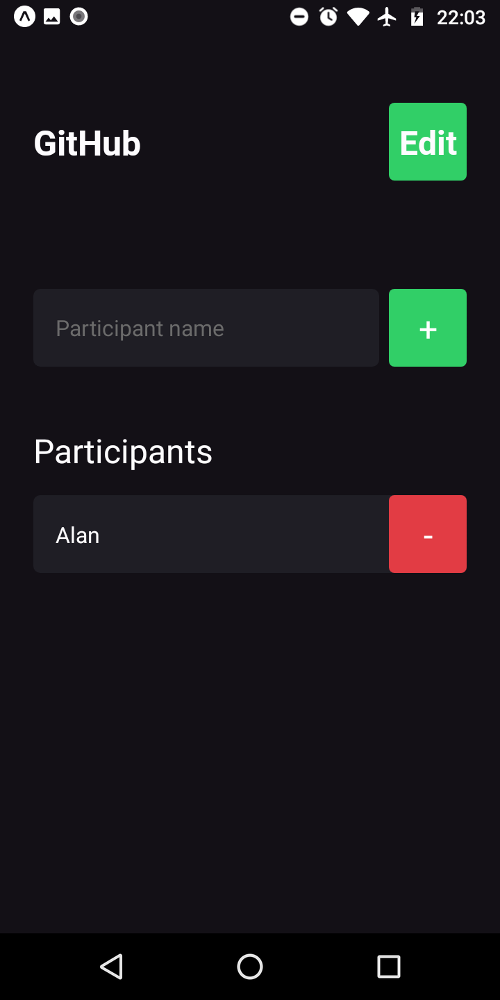

<p align="center">
  
</p>

<h1 align="center">Im Here</h1>
<p align="center">Application to manage participants in events such as lecture and workshop!</p>

<h3 align="center">

  <a href="./LICENSE" target="_blank">
    
  </a>

</h3>

<br />

<p align="center">
    
    
</p>
<p align="center">
    
</p>

<br />

# Techs

-  Expo
-  Typescript
-  React Native

## Installation of dependencies and local use

<br />

>> ### [Documentation Expo](https://docs.expo.dev/)

<br />

> Create somewhere on your pc, a folder to create a copy of the repository, inside it open command terminal and type the commands below:

```
git clone https://github.com/AlanWehrliLC/im-here.git
cd im-here
npm install
npm run start
```

<br />

> Test the app using expo

>>#### [Im Here](https://expo.dev/@alanwehrlilc/im-here)